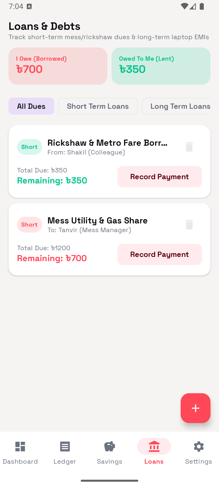

# 📱 TakaKoi — Personal Finance & Budget Tracker (Android & iOS)

[](https://github.com/fnziad/FinTrack_Android/actions/workflows/android.yml)
[](https://github.com/fnziad/FinTrack_Android/actions/workflows/ios.yml)

**TakaKoi** is a modern, high-performance cross-platform application built for intuitive expense tracking, budget management, and personal financial analytics on both **Android** and **iOS**. Built with **Kotlin Multiplatform (KMP)** and **Compose Multiplatform**, it features a premium editorial aesthetic using Material Design 3.

---

## 📸 Screenshots

| Dashboard | Ledger | Savings |
|:-:|:-:|:-:|
|  |  |  |

| Loans & Debts | Settings |
|:-:|:-:|
|  |  |

---

## 📲 Try the App

> **No build required.** Download directly from GitHub Actions CI artifacts.

### Android — Download & Install APK

1. Go to **[Actions → Build Android APK](https://github.com/fnziad/FinTrack_Android/actions/workflows/android.yml)**
2. Click the latest **passing** workflow run on `main` (stable) or `develop` (preview)
3. Under **Artifacts**, download:
   - `TakaKoi-Release-APK` — from `main` (stable, recommended)
   - `TakaKoi-Preview-APK` — from `develop` (latest features, may have rough edges)
4. Transfer the `.apk` to your Android device
5. Enable **Settings → Install unknown apps** for your file manager
6. Open the APK and tap **Install**

> ⚠️ **Minimum Android version**: API 24 (Android 7.0 Nougat)

### iOS — Simulator Testing (Developers only)

iOS distribution to real devices requires an Apple Developer account and TestFlight.
For simulator testing (developers):

1. Go to **[Actions → Build iOS Framework](https://github.com/fnziad/FinTrack_Android/actions/workflows/ios.yml)**
2. Download `TakaKoi-iOS-Simulator-Framework-Stable` or `-Preview`
3. Follow the [Developer Setup → iOS](#-ios-app-iosapp) section to integrate with Xcode
4. Run on Simulator with `Cmd + R`

---

## ✨ Features

- 📊 **Smart Dashboard**
  - **Payday Hero Card**: Real-time countdown to next salary date
  - **Spend Pace Tracker**: Live daily spending pace vs target
  - **Cost Driver Analytics**: Highest category & largest single expense
  - **Category Breakdown**: Doughnut + bar chart visualisations
- 📜 **Ledger**: Income & expense tracking with instant filtering and history
- 🎯 **Savings Goals**: Custom wallets with progress bars
- 🤝 **Loans & Debt Management**: Track money owed and debt repayments
- 🎨 **5 Theme Presets**: Light/dark with Indigo, Emerald, Ocean, Teal, Rose
- 🔤 **Space Grotesk Typography**: Geometric editorial type system
- 🍏📱 **Cross-Platform**: 100% shared Compose UI + business logic (KMP)

---

## 🛠️ Tech Stack

```
TakaKoi/
├── shared/            ← KMP shared module (ALL UI, logic, and data)
│   ├── commonMain/    ← Compose Multiplatform UI, ViewModel, Room DAOs/Entities
│   ├── androidMain/   ← SQLite driver init for Android
│   └── iosMain/       ← UIViewController wrapper for iOS
├── app/               ← Android app host (thin: just MainActivity)
└── iosApp/            ← iOS app host (thin: SwiftUI wrapper)
```

| Layer | Technology |
|---|---|
| UI | Compose Multiplatform + Material Design 3 |
| Architecture | MVVM — StateFlow + Kotlin Coroutines |
| Database | Room KMP 2.7+ (SQLite Bundled driver) |
| Networking | Ktor 3.x (OkHttp on Android, Darwin on iOS) |
| Date/Time | `kotlinx-datetime` |
| Build | Gradle 9.3.1 + AGP 9.1.1 + KMP 2.0.21 + Java 21 |

---

## 🌿 Branch Strategy

| Branch | Purpose | CI Artifacts |
|---|---|---|
| `main` | ✅ **Stable releases** — always green, tagged | `TakaKoi-Release-APK` + `TakaKoi-iOS-*-Framework-Stable` (90-day) |
| `develop` | 🔄 **Active development** — daily work | `TakaKoi-Preview-APK` + `TakaKoi-iOS-*-Framework-Preview` (14-day) |
| `feature/*` | 🧪 **Feature branches** — short-lived, PRs only | CI validation only (no artifact upload) |

```
feature/my-feature
       ↓ Pull Request (CI must pass)
   develop  ← your active workspace
       ↓ Pull Request (CI must pass)
    main    ← stable, tagged releases (v1.x.x)
```

**Rules:**
- Never commit directly to `main`
- `develop` is always in a working, buildable state
- All `feature/*` branches must pass CI before merging to `develop`
- See [CONTRIBUTING.md](CONTRIBUTING.md) for full workflow

---

## 🚀 Developer Setup

### Prerequisites

| Tool | Version | Install |
|---|---|---|
| JDK | 21 (OpenJDK / Temurin) | `brew install openjdk@21` |
| Android SDK | API 36 target, API 24 min | Android Studio or `sdkmanager` |
| Xcode | 15.0+ (iOS only) | Mac App Store |
| Kotlin Multiplatform | 2.0.21 | via Gradle |

### Environment Setup

Set `JAVA_HOME` to JDK 21 before building (required — system JDK 26+ breaks the Android SDK `jlink` step):

```bash
export JAVA_HOME="$(brew --prefix openjdk@21)/libexec/openjdk.jdk/Contents/Home"
```

Add this to your `~/.zshrc` or `~/.bashrc` to make it permanent.

### Clone & Setup

```bash
git clone https://github.com/fnziad/FinTrack_Android.git TakaKoi
cd TakaKoi

# Work on the active development branch
git checkout develop
```

---

### 🤖 Android App (`app/`)

**Build Debug APK:**
```bash
JAVA_HOME="$(brew --prefix openjdk@21)/libexec/openjdk.jdk/Contents/Home" \
  ./gradlew assembleDebug --no-configuration-cache
```

**Install on connected device / emulator:**
```bash
./gradlew :app:installDebug
```

**Run via android-cli:**
```bash
android run --apks=app/build/outputs/apk/debug/app-debug.apk --device=emulator-5554
```

---

### 🍏 iOS App (`iosApp/`)

**Build KMP Shared Framework:**
```bash
JAVA_HOME="$(brew --prefix openjdk@21)/libexec/openjdk.jdk/Contents/Home" \
  ./gradlew :shared:linkDebugFrameworkIosSimulatorArm64 --no-configuration-cache
```

**Run in Xcode:**
1. Open `iosApp/iosApp.xcodeproj` in Xcode
2. Select an **iOS Simulator** target (e.g., iPhone 15 Pro)
3. Press `Cmd + R`

> The Xcode project is pre-configured to reference the KMP shared framework from `shared/build/bin/`.

---

## ⚙️ CI/CD Pipelines

Two GitHub Actions workflows run on every push to `main` and `develop`, and on all PRs:

### Android Build (`.github/workflows/android.yml`)
- **Runner**: `ubuntu-latest`
- **JDK**: Temurin 21 (explicitly pinned — avoids system JDK 26 `jlink` issue)
- **Steps**: Checkout → JDK 21 → Gradle setup → Create `.env` → Generate keystore → `assembleDebug`
- **Artifacts**:
  - `develop` push → `TakaKoi-Preview-APK` (14 days)
  - `main` push → `TakaKoi-Release-APK` (90 days)

### iOS Build (`.github/workflows/ios.yml`)
- **Runner**: `macos-latest` + Xcode toolchain
- **JDK**: Temurin 21 (explicitly pinned per-step)
- **Steps**: Checkout → JDK 21 → `linkReleaseFrameworkIosSimulatorArm64` → `linkReleaseFrameworkIosArm64`
- **Artifacts**:
  - `develop` push → `TakaKoi-iOS-*-Framework-Preview` (14 days)
  - `main` push → `TakaKoi-iOS-*-Framework-Stable` (90 days)

---

## 🗺️ Roadmap

- [x] **iOS Support** — Kotlin Multiplatform + Compose Multiplatform migration complete
- [ ] Push notifications for payday reminders
- [ ] Cloud sync and backup via Firebase
- [ ] Recurring transaction automation
- [ ] Export transactions to CSV / PDF reports
- [ ] TestFlight distribution for iOS beta testers

---

## 🤝 Contributing

See [CONTRIBUTING.md](CONTRIBUTING.md) for branch workflow, commit conventions, and PR guidelines.

---

## 📄 License

This project is licensed under the MIT License — see the repository files for details.
