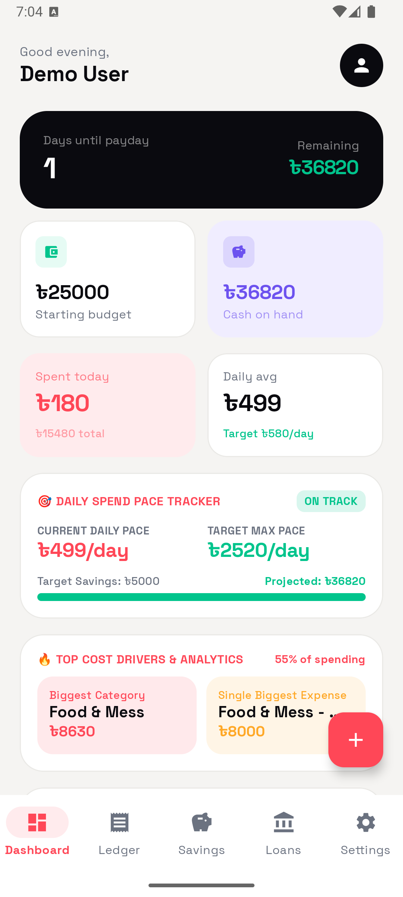
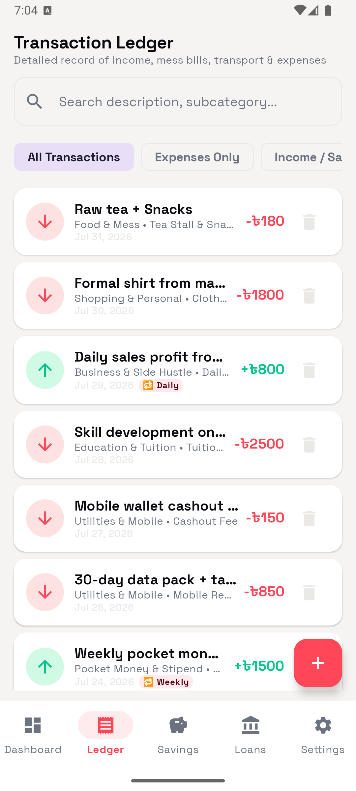
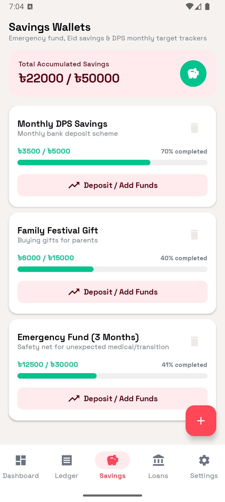
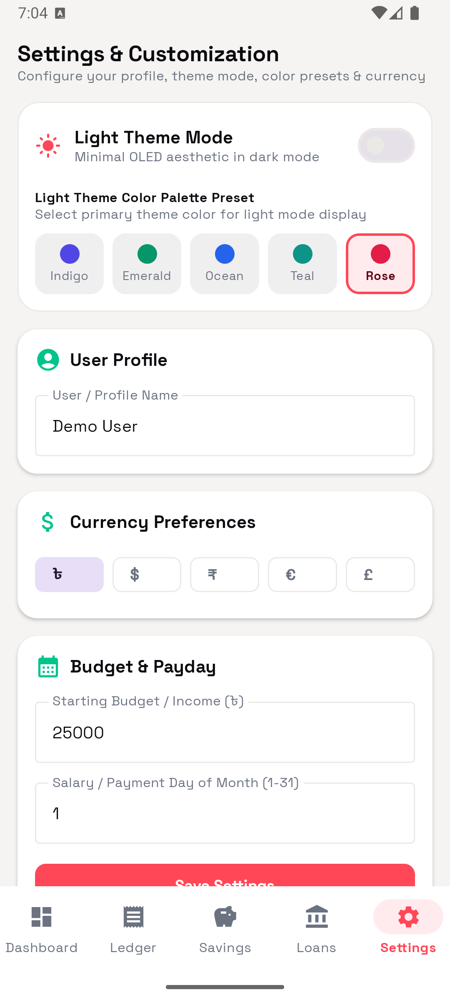

# TakaKoi — Personal Finance & Budget Tracker

[](https://github.com/fnziad/TakaKoi/actions/workflows/android.yml)
[](https://github.com/fnziad/TakaKoi/actions/workflows/ios.yml)

TakaKoi is an Android and iOS personal-finance app built with Kotlin Multiplatform and Compose Multiplatform. It tracks expenses, budgets, savings goals, loans, and recurring income with a local-first Room database.

The repository is open source, but the current CI artifacts are development/integration builds. Store distribution is not configured.

## Screenshots

The repository includes sanitized Android UI screenshots for the dashboard, ledger, savings, and settings screens. Any sample records shown in them are fictional demo data and are not user data.

| Dashboard | Ledger | Savings |
|:-:|:-:|:-:|
|  |  |  |



## Current privacy boundary

- User names, transactions, amounts, notes, savings goals, loans, and tasks are stored locally in the Room SQLite database.
- The current app has no authentication, analytics, telemetry, cloud sync, or application network calls. The build intentionally does not include Firebase/Gemini runtime services.
- Android backups are disabled and the finance database is excluded from Android backup rules. iOS database backup behavior is documented in [PRIVACY.md](PRIVACY.md).
- The sample-data action is opt-in and uses fictional values. It can be cleared from Settings.
- Do not put real credentials in this repository. Local `.env`, keystores, signing profiles, Google service files, and private certificates are ignored by Git.

See [PRIVACY.md](PRIVACY.md) for the user-data boundary and [SECURITY.md](SECURITY.md) for vulnerability reporting and public-repository rules.

## Features

- Dashboard with spend pace, category breakdown, recurring income, and cost drivers
- Income and expense ledger with filtering and history
- Savings goals with progress tracking
- Loan and debt tracking
- Theme presets and shared Compose UI on Android and iOS

## Tech stack

| Layer | Technology |
|---|---|
| UI | Compose Multiplatform + Material Design 3 |
| Architecture | MVVM, StateFlow, Kotlin Coroutines |
| Database | Room KMP 2.7+ with bundled SQLite driver |
| Date/time | `kotlinx-datetime` |
| Build | Gradle 9.3.1, AGP 9.1.1, Kotlin/JVM 2.2.10, KMP 2.0.21, Java 21 |

Ktor is not used by the current runtime; there are no current runtime HTTP calls.

## Branches and CI

| Branch | Purpose | Artifacts |
|---|---|---|
| `main` | Stable, reviewed baseline | `TakaKoi-Stable-Debug-APK` and unsigned iOS framework integration artifacts (90 days) |
| `develop` | Active development | `TakaKoi-Preview-Debug-APK` and unsigned iOS framework integration artifacts (14 days) |
| `feature/*`, `fix/*` | Short-lived pull-request branches | CI validation only |

Both workflows run on pushes to `main`/`develop` and pull requests targeting those branches.

See [CONTRIBUTING.md](CONTRIBUTING.md) for the contribution flow.

## Developer setup

### Prerequisites

- JDK 21 (Temurin/OpenJDK)
- Android SDK API 36 (minimum API 24)
- Xcode 15 or newer for iOS development

Set JDK 21 before Gradle commands on macOS:

```bash
export JAVA_HOME="$(brew --prefix openjdk@21)/libexec/openjdk.jdk/Contents/Home"
```

Clone the repository and use the development branch:

```bash
git clone https://github.com/fnziad/TakaKoi.git
cd TakaKoi
git checkout develop
```

### Android

```bash
./gradlew assembleDebug --no-configuration-cache
./gradlew :app:installDebug
```

The debug build uses a locally generated debug keystore when needed.

### iOS

```bash
./gradlew :shared:linkReleaseFrameworkIosSimulatorArm64 --no-configuration-cache
```

Open `iosApp/iosApp.xcodeproj` in Xcode and run an iOS Simulator target.

## License

The source code is licensed under the [Apache License 2.0](LICENSE). Bundled fonts and other third-party materials retain their own licenses; see [THIRD_PARTY_NOTICES.md](THIRD_PARTY_NOTICES.md).
